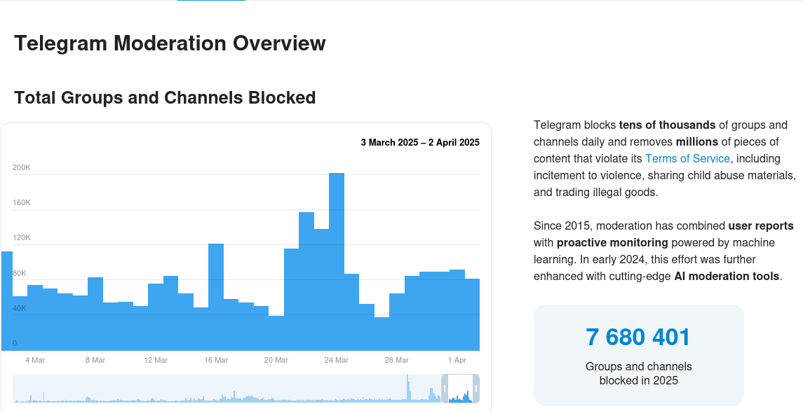

     ▄▄·  ▄▄▄· ▄▄▄  ▄▄▄▄·        ▐ ▄ 
    ▐█ ▌▪▐█ ▀█ ▀▄ █·▐█ ▀█▪ ▄█▀▄ •█▌▐█
    ██ ▄▄▄█▀▀█ ▐▀▀▄ ▐█▀▀█▄▐█▌.▐▌▐█▐▐▌
    ▐███▌▐█▪ ▐▌▐█•█▌██▄▪▐█▐█▌.▐▌██▐█▌
    ·▀▀▀  ▀  ▀ .▀  ▀·▀▀▀▀  ▀█▄▀▪▀▀ █▪


# **Carbon (Carbono)**

  


### Razão:
O projeto Carbon, ou Carbono, tem o nome derivado das folhas de carbono que servem para fazer cópias.  
Desta maneira, o foco do projeto está em salvar informações de grupos do Telegram, antes que eles sejam extintos.

Atualmente, a moderação do Telegram está banindo muitos canais, alguns sem qualquer motivo, outros por má conduta.  
  
[Mais informações sobre moderação do Telegram](https://telegram.org/moderation)

### Funcionamento:



### **Passo 1   : Clone ou faca o download do Repositorio**
```bash
git clone https://github.com/bluurw/Carbon
```

### **Passo 2: Certifique-se de instalar todas as bibliotecas e dependências**
*Isto funcionará melhor em um ambiente virtual

```bash
python -m venv "carbon"  
source /bin/activate  
pip install -r requeriments.txt
```

### **Passo 3: Obtenha uma credencial de API no Telegram**
Se ainda não possui ou não sabe como obtê-la, siga este link: [API Telegram](https://my.telegram.org/apps "Telegram")


### **Passo 4: Executar o Projeto**
Com o ambiente preparado, execute o arquivo `main.py`:  
```bash
python main.py
```

### **Passo 5: Configurar Credenciais no Menu**
No menu do *Carbon*, selecione a opção *[2] OPTIONS* e configure suas credenciais da API do Telegram.
Após configurar, você poderá utilizar as funcionalidades livremente!


## **Linha do Tempo**

- **Conceito:** 27/03/2025  
- **Primeira Versão (1.v):** 04/04/2025  
- **Atualização 1:** 05/04/2025  


## **Próximas Atualizações**

- **Integração com GitHub**:  
  Permitir que o usuário clone o conteúdo de um grupo diretamente para um repositório do GitHub.
- **Compactação de Dados**:  
  Melhorar o processo de compactação, tanto para o salvamento local quanto para a clonagem no GitHub.


Compatbilidade:
(Inserir os shields de linux, windows, e mac)
Linux - OK
Windows - Nao testado
Mac - Nao testado

